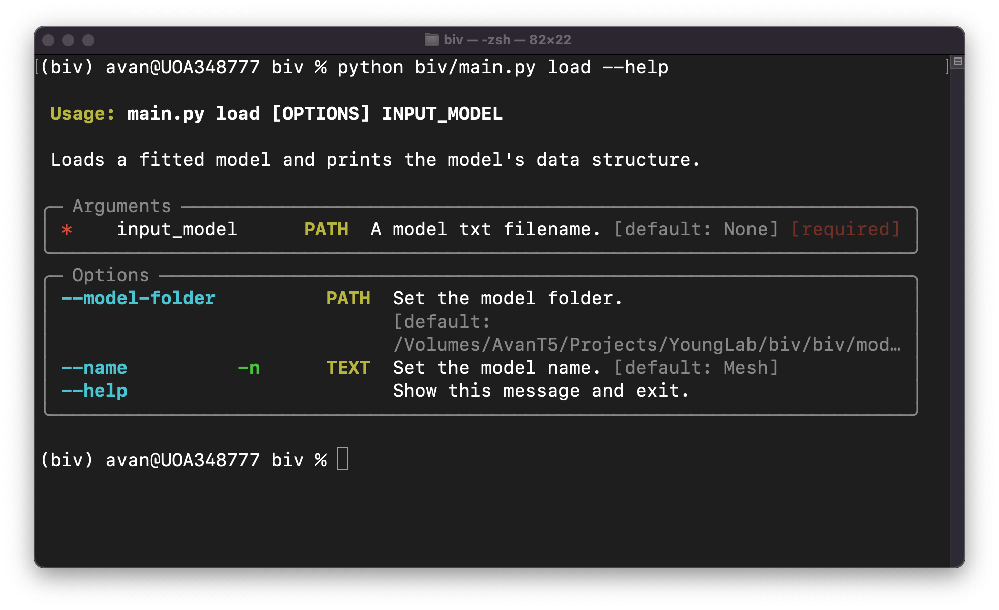
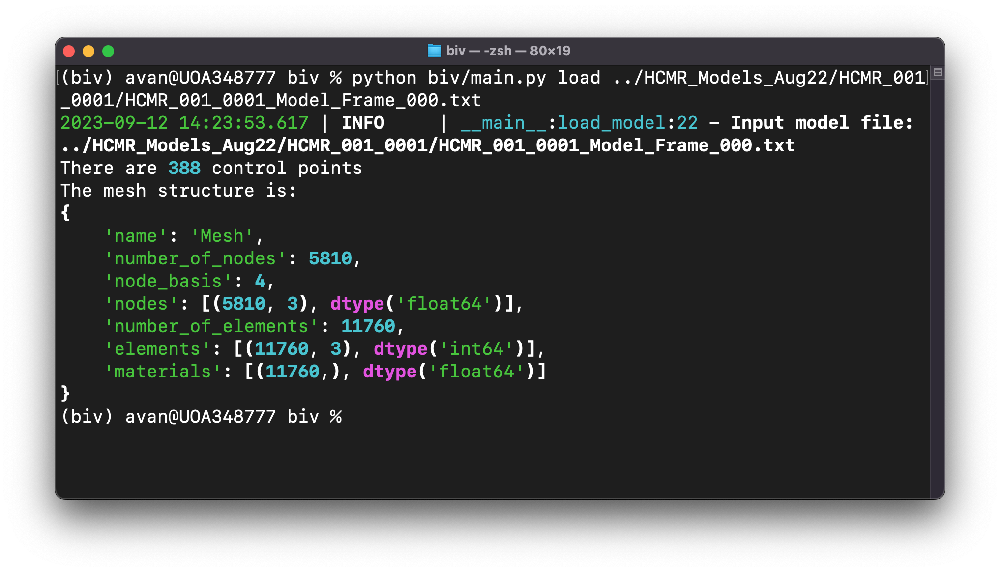

BIV
----

A simple command line tools to load, visualise, and some quick processing of a biventricular model.

### 🚀 Quick Setup

1. Create a new conda environment & activate it.
   ```shell
   $ conda create --name biv python=3.11
   ```

   ```shell
   $ conda activate biv
   ```

1. Install all packages from `requirements.txt`
    ```shell
    (biv) $ pip install -r requirements.txt
    ```

1. This tool needs [BiV_Modelling](https://github.kcl.ac.uk/YoungLab/BiV_Modelling) package. Clone & install it.
   ```shell
   (biv) $ git clone https://github.kcl.ac.uk/YoungLab/BiV_Modelling.git
   (biv) $ conda develop -u /path/to/BiV_Modelling/folder
   ```

### ⚡ Run the tools

Always use `--help` from the `main.py` to see how to use the tools:
```shell
(biv) python biv/main.py --help
```

If there are sub-commands, you can always call `--help` to show more information about that command
and what available options are.

For example, there is `load` command:
```shell
(biv) python biv/main.py load --help
```

*and so on....*


<details>
<summary><b>Load a fitted model as a `Mesh` object</b></summary>

A fitted biventricular model is usually saved as a text file in `x, y, z, Frame` column format.
These are control points. Note that there is also a column Frame, but usually a model is saved per frame.

Example:
```text
x,y,z,Frame
85.77214372028534,-62.79107797414508,-68.03511960551816,0
-5.281445933174165,-23.282425653022695,-18.217445417244353,0
-2.7152790081573337,-19.470939434006784,-18.28185160475911,0
9.360506273556178,-7.309949321326321,-11.528803933030629,0
18.440071277109148,-8.542478244200733,-1.4993056208854911,0
```

To get the subdivision model, you need to use the `Mesh` class defined in `biv/mesh_tools/mesh.py` file.
I have made a function to load a fitted model and return both the control point and the model as a `Mesh`.
See the definition of the `Mesh` class in `biv_model_io.py` file.

```python
def load_fitted_model(fitted_file: Path, model_folder: Path, name: str = 'Mesh'):
    """
    Read a fitted model.

    :param fitted_file: a fitted model as a text file
    :param model_folder: see load_biv_model function
    :param name: identify the model name
    :return: a dictionary with the following filed:
        'control_points': the control points of the model
        'mesh': a Mesh model that defines the biventricular model (see mesh_tools.mesh.Mesh class)
    """
```
Note that you need to give a model folder that defines the subdivision matrices, i.e., the `model` folder.

I have created a CLI tool to load a fitted model and print the `Mesh` object structure:


Note that the `model-folder` argument has been set by default to the correct `model` folder.
You can load a fitted model directly as follows:


</details>


<details>
<summary><b>A quick plot of points</b></summary>

Using plot function `matplotlib.pyplot` we can quickly plot points of the model in 3D view: 

```shell
(biv)  python biv/main.py plot points ../HCMR_Models_Aug22/HCMR_001_0001/HCMR_001_0001_Model_Frame_000.txt
```


</details>


### Developer notes

This tool uses `typer` library to create commands and subcommands. It's an amazing library that saves
your time to build an app. You can read more about Typer here: https://typer.tiangolo.com/

You can add more commands in the `main.py` file, or create sub-commands as I have made skeleton in the `biv_plots.py` file. 

*Have fun !!*
