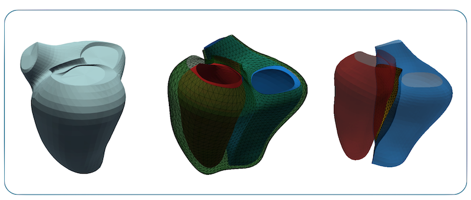
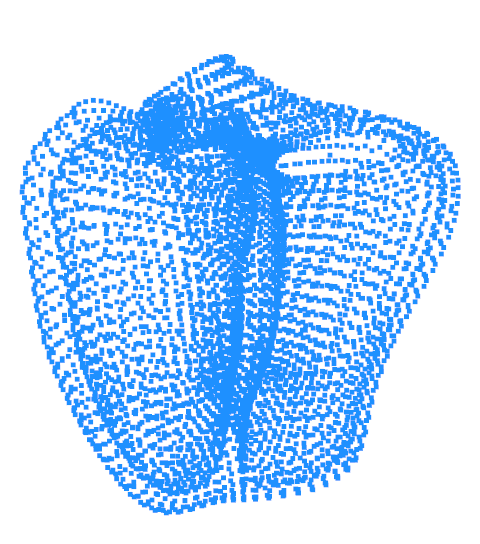
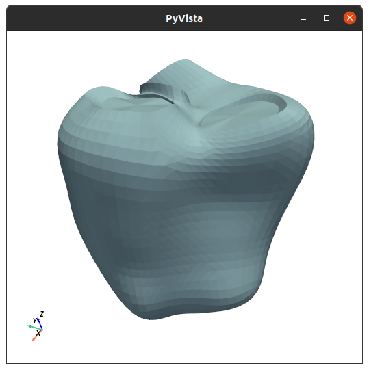
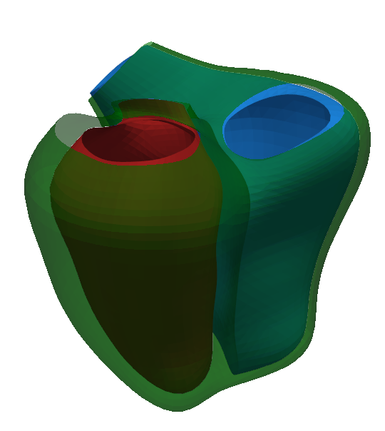
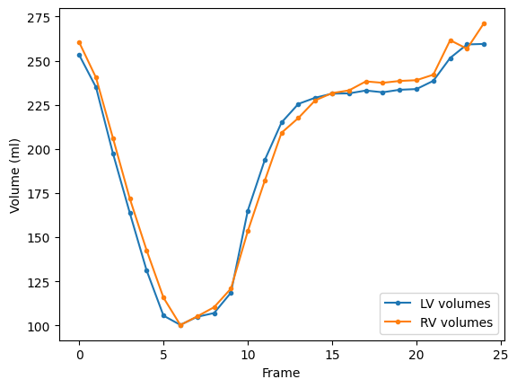
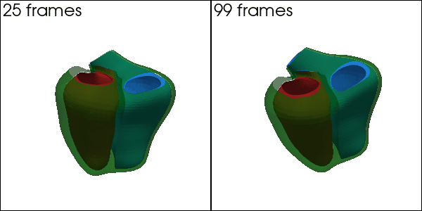
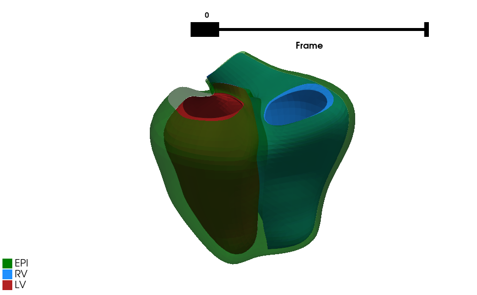

Biventricular Lite
----

<p align="center">

</p>

This package contains simple command line tools to load, visualise, and some quick processing of a biventricular model. The model was taken from from the `biv-me` package: https://github.com/UOA-Heart-Mechanics-Research/biv-me.

Note: there is no fitting functionality in this package. The input is a fitting model, where there are 388 control points in 3D format. An example of a fitted model is given in `tests/fitted_model.txt`.

## 🚀 Installation

```bash
pip install git+https://github.com/avansp/biv-lite
```

Test run the tool:
```bash
biv-lite --help
```

<details>
<summary><b>If you intend to develop the package</b></summary>

```bash
# clone project
git clone https://github.com/avansp/biv-lite
cd biv-lite

# install requirements
pip install -r requirements.txt

# additional extension to allow interactive jupyter plot
pip install trame_jupyter_extension

# install the package
pip install --editable .
```
additionally run the test
```bash
pytest
```

</details>

## 🫀 Using the `BivMesh` class

The `BivMesh` is the main class for the biventricular modelling and it only accepts a fitted model, which consists of 388 control points. An example of a fitted model is given in [tests/fitted_model.txt](tests/fitted_model.txt) file.

### Load a fitted model and print some of its properties
```python
from biv_lite import BivMesh

biv = BivMesh.from_fitted_model("tests/fitted_model.txt")
print(biv)
```

will output
```text
<BivMesh> object
  Label: biv_mesh
  Control points: (388, 3), dtype: float64
  Vertices: (5810, 3), dtype: float64
  Faces: (11920, 3), dtype: int64
  Components: AORTA_VALVE, AORTA_VALVE_CUT, LV_ENDOCARDIAL, LV_EPICARDIAL, MITRAL_VALVE, MITRAL_VALVE_CUT, PULMONARY_VALVE, PULMONARY_VALVE_CUT, RV_EPICARDIAL, RV_FREEWALL, RV_SEPTUM, THRU_WALL, TRICUSPID_VALVE, TRICUSPID_VALVE_CUT
```

More examples and explanations are given in the [notebooks folder](notebooks).

## 🏃🏽 CLI tools

There are some tools that you can call directly from the command-line interface, either using `main.py` file:
```shell
python src/biv_lite/main.py --help
```

or `biv-lite` command:
```shell
biv-lite --help
```

Some CLI examples

<details>
<summary><b>Load a fitted model as a `Mesh` object and print its structure</b></summary>

There is an example fitted model file in the `tests` folder:
```bash
biv-lite load tests/fitted_model.txt
```

Output:
```text
There are 388 control points
After subdivision, here is the mesh structure:
{
    'name': 'Mesh',
    'number_of_nodes': 5810,
    'node_basis': 4,
    'nodes': [(5810, 3), dtype('float64')],
    'number_of_elements': 11760,
    'elements': [(11760, 3), dtype('int64')],
    'materials': [(11760,), dtype('float64')]
}
```

</details>


<details>
<summary><b>A quick plot of surface points</b></summary>

```shell
biv-lite plot points tests/fitted_model.txt
```


</details>

<details>
<summary><b>A quick plot of surface mesh</b></summary>

```shell
biv-lite plot mesh tests/fitted_model.txt
```


</details>

<details>
<summary><b>A quick plot of the LV & RV meshes</b></summary>

```shell
biv-lite plot biv tests/fitted_model.txt
```


</details>

<details>
<summary><b>Volume and mass calculation</b></summary>

```shell
biv-lite volumes tests/fitted_model.txt
```

```text
2025-03-06 19:33:39.918 | INFO     | biv_measures:compute_volume:22 - Computing volumes and masses of tests/fitted_model.txt
{
    'lv_vol': 253.280039260176,
    'rv_vol': 260.47160066078743,
    'lv_epi_vol': 469.0292227955365,
    'rv_epi_vol': 324.1358505950869,
    'lv_mass': 226.53664271212853,
    'rv_mass': 66.84746243101442
}
```

</details>

## 🦍 Super-charged classes

### `BivFrames`

The `BivFrames` class contains a list of `BivMesh` objects and can provide a convenient class to handle a full frame cardiac models.

`BivFrames` reads a folder that contains fitted model files
, and sort the frame numbers based on the filenames. There is an example of biventricular frames provided in `tests/sample_frames`.

```python
from biv_lite import BivFrames

bivs = BivFrames.from_folder(r'tests/sample_frames/')
len(bivs)
```

Output:
```text
25
```

You can also compute volumes and other measurements.
```python
import matplotlib.pyplot as plt
from biv_lite import BivFrames

bivs = BivFrames.from_folder(r'tests/sample_frames/')
vols = bivs.volumes()
plt.plot(vols['LV_ENDO'], marker='.', label='LV volumes')
plt.plot(vols['RV_ENDO'], marker='.', label='RV volumes')
plt.xlabel('Frame')
plt.ylabel('Volume (ml)')
plt.legend()
```



### `BivParametric`

The `BivParametric` takes a higher level of `BivFrames` where you can instantiate a `BivMesh` object at any time between 0.0 to 1.0, thus providing interpolated cardiac models.

Let's try to upsample the model frames from 25 to 99 frames:
```python
from biv_lite import BivFrames, BivParametric
import numpy as np

bivs = BivFrames.from_folder('tests/sample_frames/')
biv_p = BivParametric(bivs)

# upsampling
ts = np.linspace(0, 1.0, 100)
ts = ts[:-1]

# interpolate
biv_interp = biv_p(ts)
len(biv_interp)
```

Output:
```text
99
```

Plot them side-by-side:



### `BivMotionUI`

The `BivMotionUI` provides pyVista graphical user interface to visualise a biventricular mesh object with some interactions.

```python
from biv_lite import BivFrames, BivMotionUI

bivs = BivFrames.from_folder(r'tests/sample_frames/')
ui = BivMotionUI(bivs)
ui.plotter.show()
```



_Widgets above are interactive by toggle on/off visibility & selecting frame using a slider._

## 🕹️ Developer notes

This tool uses `typer` library to create commands and subcommands. It's an amazing library that saves
your time to build an app. You can read more about Typer here: https://typer.tiangolo.com/

You can add more commands in the `main.py` file, or create sub-commands as I have made skeleton in the `biv_plots.py` file. 

*Have fun !!*
